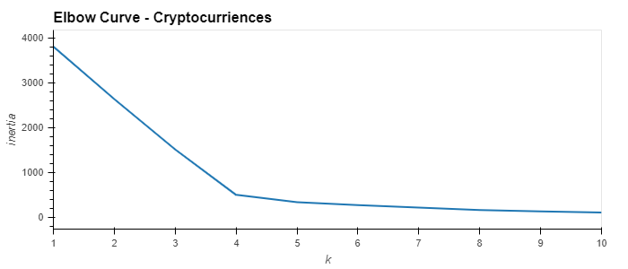

# Cryptocurrencies

## Background
Martha is a senior manager for the Advisory Services Team at Accountability Accounting, one of your most important clients. Accountability Accounting, a prominent investment bank, is interested in offering a new cryptocurrencies investment portfolio for its customers. The company, however, is lost in the immense universe of cryptocurrencies and asks you to present a report of what cryptocurrencies are on the trading market and how cryptocurrencies could be grouped toward creating a classification for developing this new investment product.

The data Martha will be working with is not ideal, so it will be processed to fit the machine learning models. Since there is no known output for what Martha is looking for, she decided to use unsupervised learning. To group the cryptocurrencies, Martha decided on a clustering algorithm to help determine about investing in this product. She’ll use data visualizations to share her findings with the board.

### Objectives
The goals for this challenge are to:

* Prepare the data for dimensions reduction with PCA and clustering using K-means.
* Reduce data dimensions using PCA algorithms from sklearn.
* Predict clusters using cryptocurrencies data using the K-means algorithm form sklearn.
* Create some plots and data tables to present your results.

## Resources
* Python 3.7
* Jupyter Notebook
* Libraries:  pandas, scikit-learn, hvplot, plotly express
* Data: crypto_data.csv (The data was retrieved from [CryptoCompare API](https://min-api.cryptocompare.com/data/all/coinlist))

## Analysis
The .csv data is read into a pandas DataFrame (df) where it is cleaned and prepared (e.g. unnecessary/null rows and columns removed).  The TotalCoinSupply column was a string, so it was converted to a float.  CoinNames are stored in a separate df where they can be accessed later (i.e. merged with other df's as needed).  We then create dummies variables to convert the textual columns into numeric so they can be used by the machine learning algorithm.  
Next, we reduce the data dimensions using the PCA model to narrow the data down to 3 principal components.  Now we can cluster the cryptocurrencies using the K-means algorithm.  To find the best number for K (number of clusters), we generate an Elbow Curve.   
  
 
Based on this Elbow Curve we choose n_clusters=4 to run our K-Means agorithm on the dataframe, pcs_df, created from the PCA model.  Finally, the clustered_df is created by merging the appropriate df's from earlier in the code and is exported as an Excel file [clustered_data.xlsx](Resources/clustered_data.xlsx).  Additionally, the resulting information is visualized with the 3d plot and scatter plots below.  
 
<<<<<<< HEAD
 
 

 

